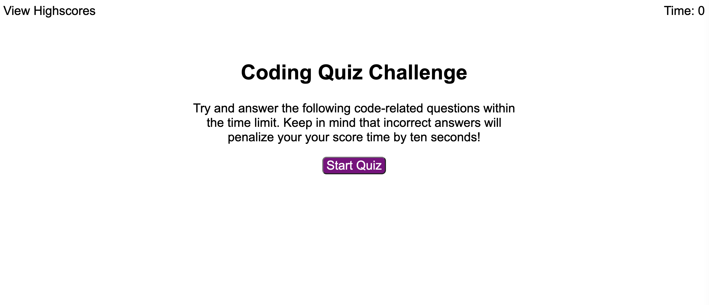
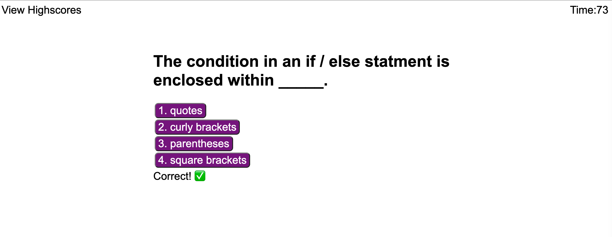

# Coding-Quiz-Challenge

# User Story
As a coding boot camp student, I want to take a timed quiz on JavaScript fundamentals that stores high scores, so that I can gauge my progress compared to my peers

When you first arrive to the website, you will have to click the 'Start Quiz' button. You will see the first question come up. Once you answer this question, you will see a notification come up under the question that will tell you whether your answer choice was correct or incorrect. If you answer is incorrect, 10 second will be deducted from your time.

Next, you will move onto the next question. You cannot move forward without answering the current question. The quiz will end once all questions have been answered or if your time hits 0. 

Once the test is completed, you will be able to input your initials and save your score. You can keep track of your scores by clicking on 'View Highscores' in the top left corner of the homepage and you can choose to clear the scores once you make it to the scores page. 

# Installation
Run using the github URL: https://jcastillo9.github.io/Coding-Quiz-Challenge/

# Screenshot

